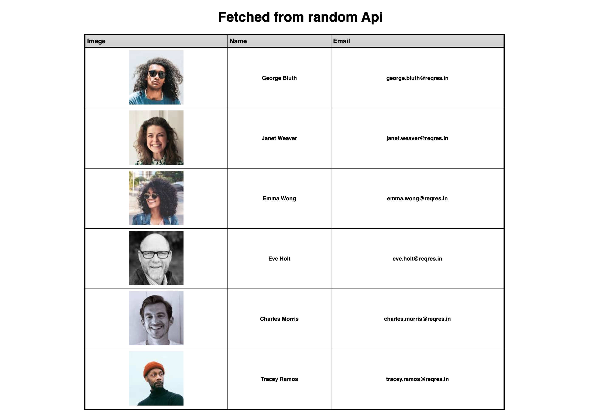

# Data fetched into a table with React 
---

### Author Links

👋 Hello there, I'm Joe Debrah

✅ [Check out my other Web Development portfolio's here on Github](https://github.com/JoeDebrah).

---
---

🚀 Check out my Linkedin below:

- [Github](https://github.com/JoeDebrah)
- [LinkedIn](https://www.linkedin.com/in/joe-debrah-953972264/)

---
---

### Description

🛠️ This is an interesting project i built with the help of the resources available of the React.dev website. It is a simple website to display a bunch of users fetched from an external dummy api and was largely built with React. 

---

🌅 [Check the preview_screenshots for a preview of the site](preview_screenshots) for this repository.


---

### 📚 Website References
- 🔗 [React Official Website](https://react.dev/)

---

## Getting Started

First, run the npm install command:

```bash
npm install
# and then
npm  start
```

Open [http://localhost:3000](http://localhost:3000) with your browser to see the result.

